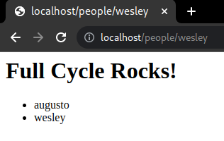
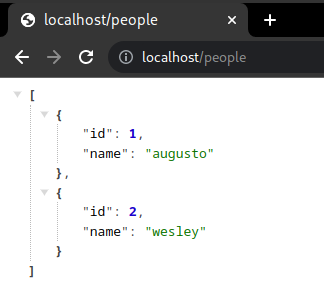

# fullcycle-desafio-docker
Implementação do desafio do módulo de Docker do Curso Full Cycle 3.0 ministrado pelo Wesley Williams.


## Estrutura de diretórios do "Desafio Docker"
```
├── README.md
└── src
    ├── db
    │   ├── init.sql
    │   └── mysqld.cnf
    ├── docker-compose.yaml
    ├── go
    │   ├── Dockerfile
    │   ├── go.mod
    │   └── main.go
    ├── nginx
    │   └── nginx.conf
    └── node
        ├── Dockerfile
        ├── index.js
        └── package.json
```


---


## Desafio Docker - Go

- [x] Criar um app em golang, que imprima a mensagem `"Full Cycle Rocks!!"` na saída padrão
- [x] Dockerizar o app, de modo que a `imagem final tenha menos que 2MB`
- [x] Publicar a imagem no Dockerhub usando o padrão `<meu-usuario-do-dockerhub>/fullcycle`


## Estrutura de diretórios
```
├── Dockerfile
├── go.mod
└── main.go
```


### Como rodar o projeto
``` shell
#### Construa você mesmo a imagem e suba um container 
docker build -f src/go -t me/fullcycle:desafio-docker-go src/go
docekr run me/fullcycle:desafio-docker-go

#### Suba um container usando imagem já publicada no DockerHub
docker run aleroxac/fullcycle:desafio-docker-go
```


---


## Desafio Docker - Nginx com Node.js

- [x] Criar um docker-compose.yaml com um service para o mysql
    - [x] Criar docker-compose.yaml
    - [x] Criar database
    - [x] Criar tabela `people`

- [x] Criar um app em nodejs, que:
    - [x] Rode na porta 8080
    - [x] Tenha uma rota com os seguintes comportamentos:
        - [x] Insira um registro no banco de dados mysql
        - [x] Imprima a mensagem `<h1>Full Cycle Rocks!</h1>`
        - [x] Liste os nomes cadastradis no banco de dados mysql
- [x] Dockerizar o app em nodejs
- [x] Adicionar um service no docker-compose.yaml para o app

- [x] Adicionar um service no docker-compose.yaml para o nginx
    - [x] Criar arquivo de configuração do nginx
    - [x] Adicionar um service no docker-compose.yaml para o nginx


## Estrutura de diretórios
```
└── src
    ├── db
    │   ├── init.sql
    │   └── mysqld.cnf
    ├── docker-compose.yaml
    ├── nginx
    │   └── nginx.conf
    └── node
        ├── Dockerfile
        ├── index.js
        └── package.json
```


### Como rodar o projeto
``` shell
### Suba os containers
docker-compose -f src/docker-compose.yaml up -d --build

### Cadastre seu nome do banco de dados e veja a lista de pessoas cadastradas em formato HTML
open http://localhost/people/augusto

## Veja a lista de pessoas cadastradas em formato JSON
curl -sv http://localhost/people
```
